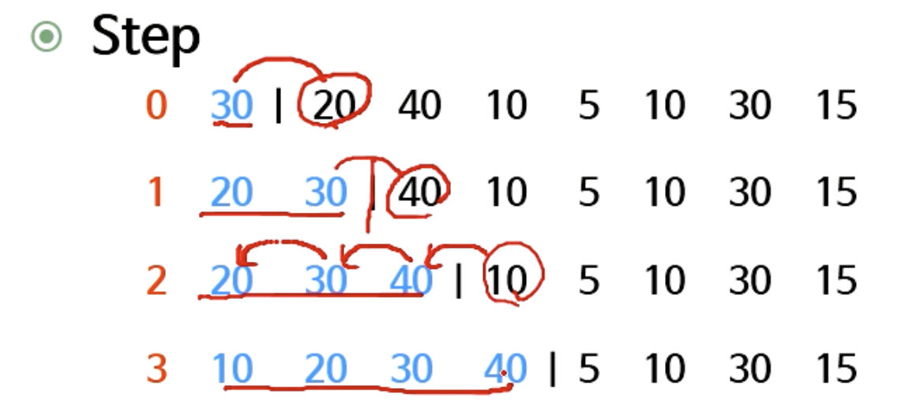
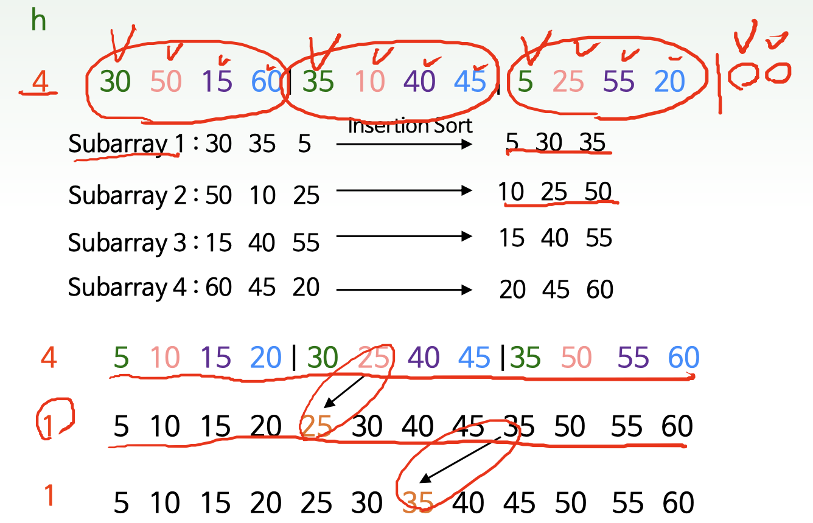
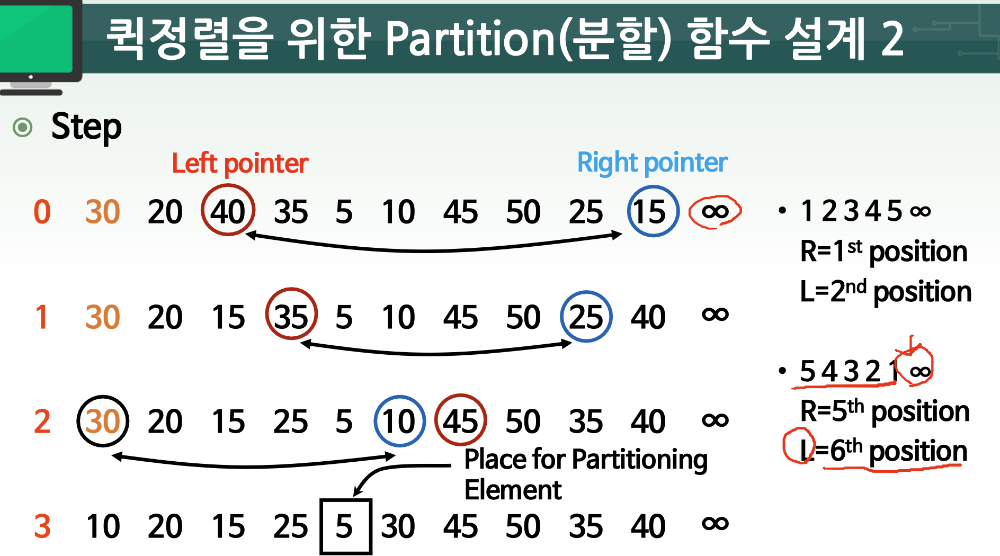
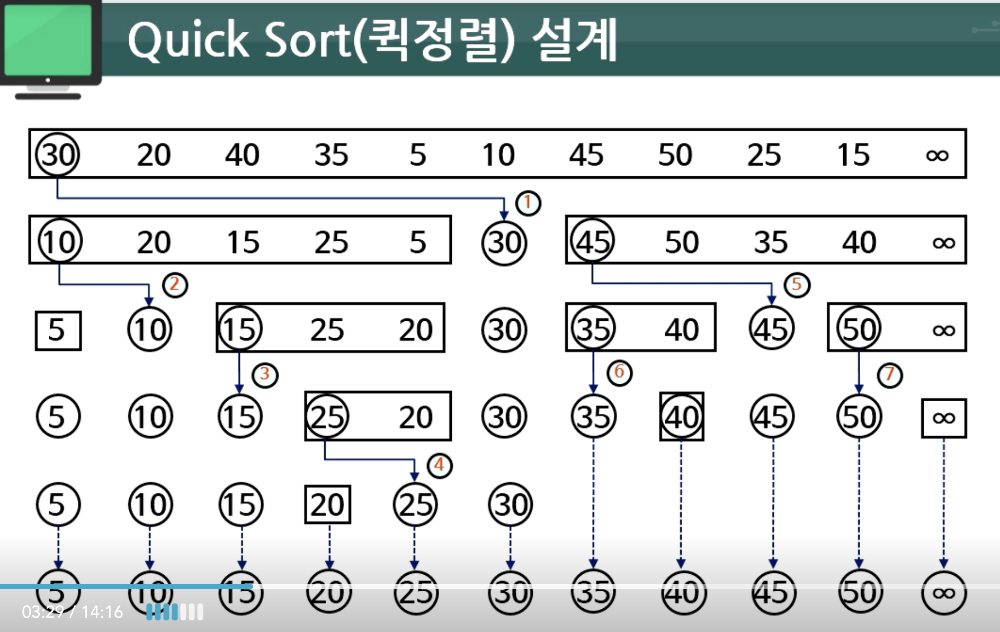

# 03. 삽입정렬, 쉘정렬, 퀵정렬

- [삽입정렬](#삽입정렬)
- [쉘정렬](#쉘정렬)
- [퀵정렬](#퀵정렬)

## 삽입정렬



- 맨 처음 원소는 정렬되어 있다고 가정
- 반복내용
    1. 비교
    2. 필요시 교환
    3. 첫 번째 원소인지 확인
- **첫 번째 원소인지 확인** 과정을 매번 하는 것은 비효율
- 맨 앞에 `-무한`을 넣으면 확인 과정이 없어도 됨
- 갑자기 넘겨서 삽입하느게 아니라 버블처럼 인접한 원소끼리 교환하는 것!!
- 그게 정렬될때까지 쭉 하는거임

### 코드와 이해

```c
void InsertionSort(int A[ ], int n)
/* 입력: A[0:n] , n: 원소의 개수. A[0]: dummy(-무한).
출력: A[0:n] : A[0]: dummy, A[1:n]은 정렬된 배열임*/
{ 
    int i, j, Value;
    for (i ＝ 2; i ＜＝ n; i＋＋) {
        Value ＝ A[i];
        j ＝ i;
        while (A[j－1] ＞ Value) {
            A[j] ＝ A[j－1]; 
            j－－;
        }
        A[j] ＝ Value;
    }
}
```

- 내부 while 문은 항상 비교하다 `A[0](-무한)` 과 비교하게 되어서 힝싱 종료됨

### 특징 정리
- 최선시간복잡도 = O(n)
    - 이미 정렬된 레코드 -> n-1번 비교
    - 최선 최악 크게 달라지는 경우라 조금 중요함
    - 일부 요소가 이미 정렬되어 있거나, 이미 정렬되어 있다면 효율적
- **평균시간복잡도** = O(n2)
- **최악시간복잡도** = O(n^2)
    - 이미 역순정렬된 경우 최악 케이스
- **제자리성** : 제자리 정렬
    - i, j, Value 등 상수 크기 메몰
- **안정성** : 안정된 정렬
    - 인접한 레코드끼리만 자리바꿈


## 쉘정렬



- 먼저 특정 갯수`ex) h`로 원소를 그룹 지음
- 각 그룹의 첫번째 데이터들끼리 비교해서 삽입정렬처럼 정렬함
- 그룹내의 순서가 같은 데이터들끼리 그룹을 지어서 삽입정렬함
- **삽입정렬에서는 원소가 이동시 한칸씩밖에 못 움직이지만, 쉘정렬은 쉘의 크기 h만큼 원소가 이동함**
- 그 후 삽입정렬을 한번 더 실행함
- **삽입정렬의 장점인, 일부가 사전정렬 된 경우 효율적이다**라는 점을 활용한 것

### 코드와 이해
```c
void ShellSort(int A[ ], int n) { 
/* 입력: A[0:n-1] , n : 정렬할 원소의 개수.
출력: A[0:n-1] : 정렬된 배열. */
    int h, i, j, Value;
    h ＝ 1;
    do h ＝ 3 * h ＋ 1; while (h ＜ n);
    do {
        h ＝ h / 3;
        for(i ＝ h; i < n; i＋＋) {
            Value ＝ A[i];
            j ＝ i;
            while (A[j－h] ＞ Value) {
                A[j] ＝ A[j－h];
                j －＝ h;
                if (j ＜h-1) break; 
            }
        A[j] ＝ Value; 
        } 
    } while ( h ＞ 1); 
}
```

- `do h ＝ 3 * h ＋ 1; while (h ＜ n);`를 통해 원소의 갯수를 넘지 않는 가장 큰 h를 얻을 수 있음
- 적절한 h값을 선택하는 과정이 중요
- 첫번째 그룹은 이미 정렬되어있다고 가정하고, 나머지 그룹의 같은 순서 원소를 빼내어서 삽입정렬
- 비교시에소 `A[j-h]`이기 때문에 각 그룹내 같은 순서의 원소를 비교
- `while ( h ＞ 1);` 코드에서 알 수 있듯 `ex) 10 7 4 1` 이렇게 쉘의 크기가 줄어들음

### 특징 정리
- **최악시간복잡도** = O(n^3/2)
    - 증명 과정은 굉장히 복잡해서 생략
    - 3h 구조의 1, 4, 13, 40... 일때
- **제자리성** : 제자리성
    - i, j, Value등 상수 크기 메모리
- **안정성** : 불안정성
    - 인접한 데이터끼리 바꾸는 것이 아닌, 그룹 내 같은 순서 데이터를 바꾸므로, 원래 동일했던 같은 키값의 데이터 순서가 정렬 후 변할 수 있음

## 퀵정렬

### 퀵정렬을 위한 분할 함수 설계
- 특정 원소를 제자리에 위치 시키는 함수
- 그 원소를 첫번째 수라 가정하고 그 수가 위치해야할 원래 자리를 구하는 함수
- 분할 원소를 기준으로 왼쪽에는 원소보다 작은 수들이, 오른쪽에는 원소보다 큰 수들이 위치하게 됨



- 첫 수를 기준으로 오른쪽으로 이동하며 원소가 첫 수보다 큰지 확인하는 `Left Pointer`와, 왼쪽으로 이동하며 첫 수보다 작은지 확인하는 `Right Pointer`를 만듬.
- `Left Pointer`와 `Right Pointer` 모두 해당하는 조건의 원소를 찾으면 둘을 SWAP함.
- 만약 `Right Pointer`와 `Left Pointer`가 교차하면 `Right Pointer` 원소와 첫 수를 SWAP하고 분할 함수는 종료됨.
- **다만 역순 정렬인 경우**
    - `Left Pointer`는 첫 수(가장 큰 수)보다 큰 수를 찾을 수 없게 됨...
    - `Left Pointer`가 원소를 탐색하며 마지막 위치인지 확인하는 작업이 필요함
    - 주어진 데이타의 오른쪽 끝에 `+무한`에 해당하는 더미데이터를 넣으면 위치 확인 작업이 불필요

### 분할 함수 코드와 이해
```c
int Partition(int A[ ], int Left, int Right) { 
/* 입력: A[Left] - 분할 원소, A[Right] - dummy
출력: A[Left:Right], Right - index */
    int PartElem, Value;
    PartElem＝ Left; 
    Value ＝ A[PartElem];
    do {
        // Left Pointer 기능
        do while(A[＋＋Left] ＜ Value);
        // Right Pointer 기능
        do while(A[－－Right] ＞ Value);
        // 위치 역전인지 탐지하는 기능
        if (Left ＜ Right)
            Swap(&A[Left], &A[Right]);
        else 
            break;
    } while (1);
    A[PartElem] ＝ A[Right];
    A[Right] ＝ Value;
    return Right; 
}
```

### 퀵정렬 코드와 이해



- 분할 함수를 모두 정렬될때까지 계속 실행하며 정렬시킴
- (분할 정복 기법인덧....)

```c
void QuickSort(int A[ ], int Left, int Right) {
/* 입력: A[Left:Right＋1], A[Right＋1]: 최대값보다 큰 값.
출력: A[Left:Right], A[Right＋1]: dummy */
    int k;// position of partition
    if (Right ＞ Left)
        k ＝ Partition(A[ ], Left, Right＋1);
    QuickSort(A[ ], Left, k －1);
    QuickSort(A[ ], k ＋ 1, Right);
}
```

### 특징 정리
- **평균시간복잡도** = O(nlogn)
- **최악시간복잡도** = O(n^2)
    - 분할원소가 항상 가장 큰 key값이거나, 가장 작은 key인 경우
- **제자리성** : 제자리 정렬
    - 단, 순환함수의 임시변수 및 복귀 주소 저장용 메모리가 추가적으로 사용됨
- **안정성** : 불안정