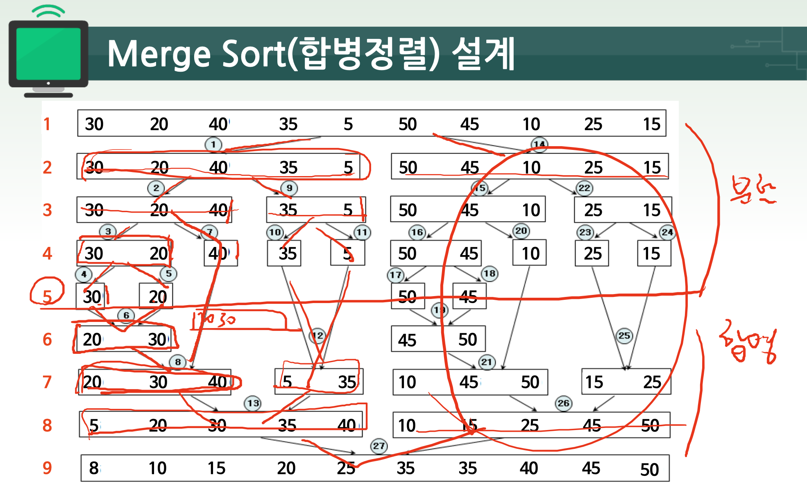
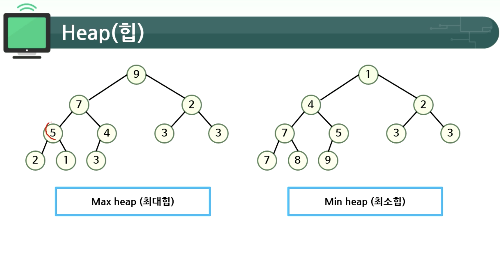
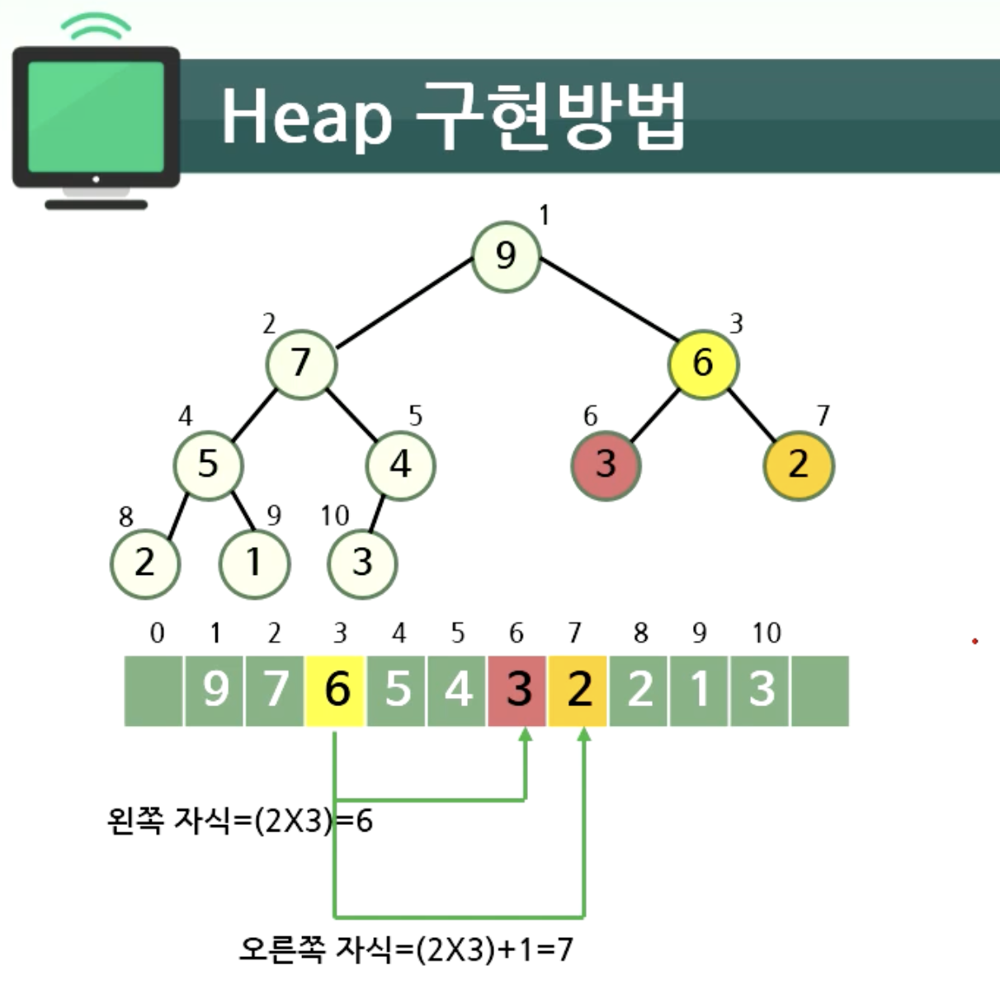
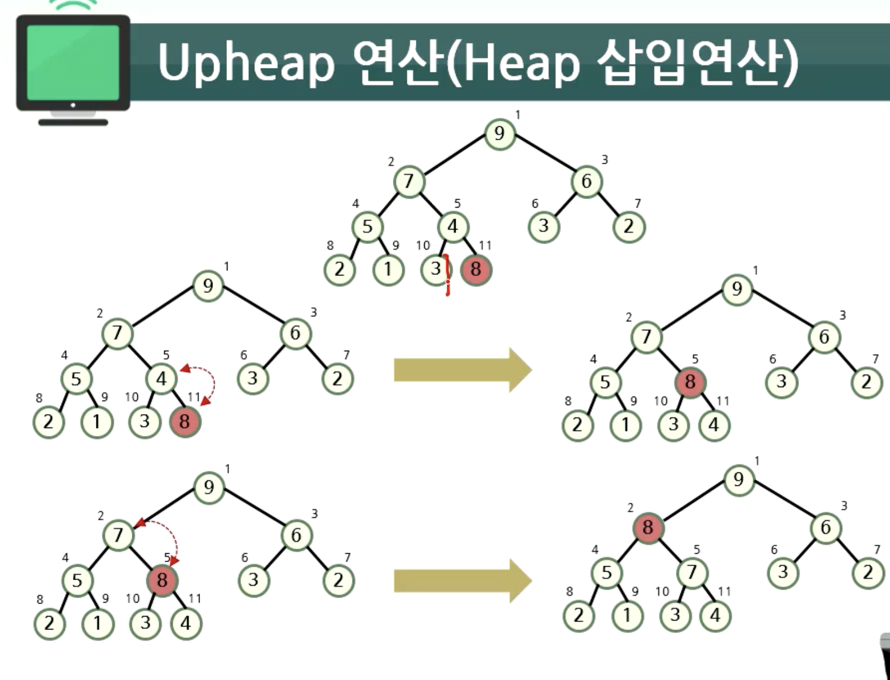
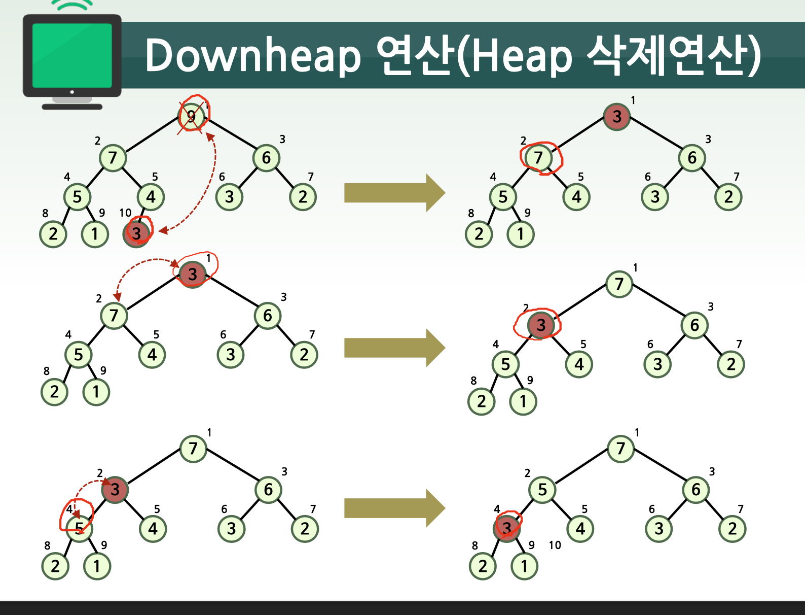

# 04. 합병정렬, 힙정렬, 전체 정렬 정리

- [합병정렬](#합병정렬)
    - [합병함수](#합병함수)
    - [합병정렬 코드와 이해](#합벙정렬-코드와-이해)
    - [합병정렬 특징 정리](#합병정렬-특징-정리)
- [힙정렬](#힙정렬)
    - [힙의 정의](#힙의-정의)
    - [힙 구현방법](#힙-구현방법)
- [전체 정렬 정리](#전체-정렬-정리)

## 합병정렬



- 분할과 합병의 과정이 존재함

## 합병함수

```c
void Merge(int A[ ], int Left, int Mid, int Right) { 
/* 입력: A[Left:Mid], A[Mid＋1:Right] - 정렬된 두 배열.
출력: A[Left:Right] - A[Left:Mid]와 A[Mid＋1:Right] 를 합병*/
    int B[NUM_OF_KEYS], i, LeftPtr, RightPtr, BufPtr;
    LeftPtr ＝ Left; RightPtr ＝ Mid ＋ 1; BufPtr ＝ Left;
    while (LeftPtr ＜＝ Mid && RightPtr ＜＝ Right)
        if (A[LeftPtr] ＜ A[RightPtr])
            B[BufPtr＋＋] ＝ A[LeftPtr＋＋];
        else 
            B[BufPtr＋＋] ＝ A[RightPtr＋＋];
    if (LeftPtr ＞ Mid) f
        for (i＝ RightPtr; i ＜＝ Right; i＋＋)
            B[BufPtr＋＋] ＝ A[i];
    else 
        for (i＝ LeftPtr; i ＜＝ Mid; i＋＋)
            B[BufPtr＋＋] ＝ A[i];
    for (i＝ Left; i ＜＝ Right; i＋＋)
        A[i] ＝ B[i];
}
```
- m = Mid-Left+1,n = Right-(Mid+1)+1
- **최선시간복잡도** = min(m,n) `Ex. 2 3 4 0 1 7 8 9 5 6`
- **최악시간복잡도** = m+n-1 `Ex. 0 8 4 2 6 1 9 5 3 7`
- **제자리성** : 입력크기에 비례하는 B 행렬 필요
- **안정성** : 안정적, 순차적 이동

## 합병정렬 코드와 이해

```c
void MergeSort(int A[ ], int Left, int Right) { 
/* 입력: A[Left:Right], Left, Right
출력: A[Left:Right] - 정렬된 배열. */
    int Mid;
    if (Left ＜ Right) {
        Mid ＝ (Left ＋ Right)/2;
        MergeSort(A[ ], Left, Mid);
         MergeSort(A[ ], Mid＋1, Right);
        Merge(A[ ], Left, Mid, Right);
    } 
}
```
## 합병정렬 특징 정리
- **최악시간복잡도** = O(nlogn) `Ex. 0 8 4 2 6 1 9 5 3 7`
- **제자리성** : 제자리 정렬 아님
    (Merge 함수에서 입력크기에 비례하는 메모리 사용)
- **안정성**: 안정적

## 힙정렬

### 힙의 정의



- **힙** : 노드들이 저장하고 있는 키들이 다음 성질을 만족하는 완전이진트리 형태의 자료구조
- **최대 힙** : 부모 노드의 키 값이 자식 노드의 키 값보다 크거나 같은 완전 이진 트리
- **최소 힙** : 부모 노드의 키 값이 자식 노드의 키 값보다 작거나 같은 완전이진트리
- **완전이진트리** : 부모 노드부터 마지막 자식 노드 전까지 값들이 차 있고, 왼쪽 -> 오른쪽으로 정렬된 트리, 마지막 자식 노드는 다 안차있어도 되지만, 왼쪽 -> 오른쪽 순서로 차있어야 함

### 힙 구현방법



**배열을 이용하여 구현 가능**
- 완전이진트리이므로 각 노드에 번호(인덱스) 부여 가능
- L자식 인덱스 = (부모 인덱스)*2
- R자식 인덱스 = (부모 인덱스)*2 + 1
- 부모 인덱스 = (자식 인덱스)/2

### Upheap 연산(Heap 삽입연산)



- **시간 복잡도** = O(logn)

1. 삽입된 노드를 마지막 위치에 삽입
2. 삽입된 노드로부터 루트까지의 경로에 있는 노드들의 **키 값을 비교, 교환함**으로써 Heap 성질 복원
3. 키 값이 부모 노드보다 작거나 같으면 종료 (Max Heap가정)


### Downheap 연산(Heap 삭제연산)



- 힙에서의 삭제는 루트 노드 삭제를 의미
- **시간 복잡도** = O(logn)

1. 루트 노드 복사 후 삭제
2. 마지막 노드를 루트로 이동
3. 루트에서 단말 노드까지의 경로에 있는 노드들의 키 값을 비교, 교환함으로써 Heap 성질 복원
4. 키 값이 자식 노드보다 크거나 같으면 종료 (Max Heap가정)

### 힙정렬 설계

## 전체 정렬 정리

| 정렬 이름 | 최악 (빅세타) | 평균 (빅오) | 제자리성 | 안정성 |
|:---:|:---:|:---:|:---:|:---:|
| 선택 정렬 | O(n^2) | O(n^2) | O | X |
| 버블 정렬 | O(n^2) | O(n^2) | O | O |
| 삽입 정렬 | O(n^2) | O(n^2) | O | O |
| 쉘 정렬 | O(n^2) | O(n^1.5) | O | X |
| 퀵 정렬 | O(n^2) | O(nlogn) | O | X |
| 병합 정렬 | O(nlogn) | O(nlogn) | X | O |
| 힙 정렬 |  O(nlogn) | O(nlogn) | O | X |
