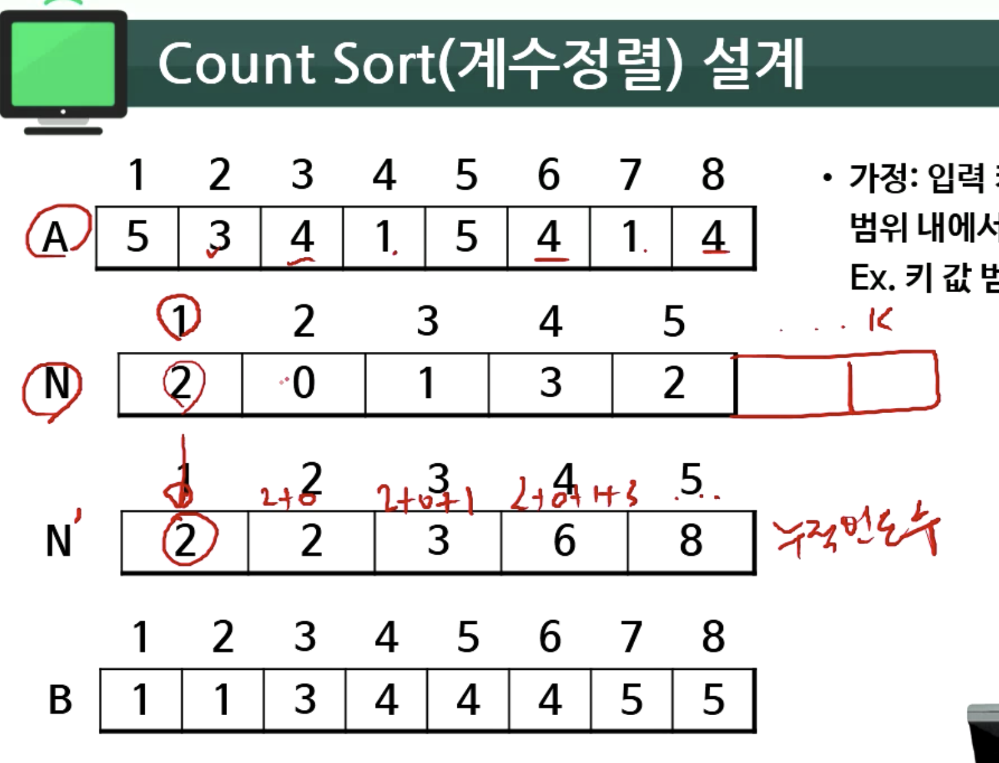
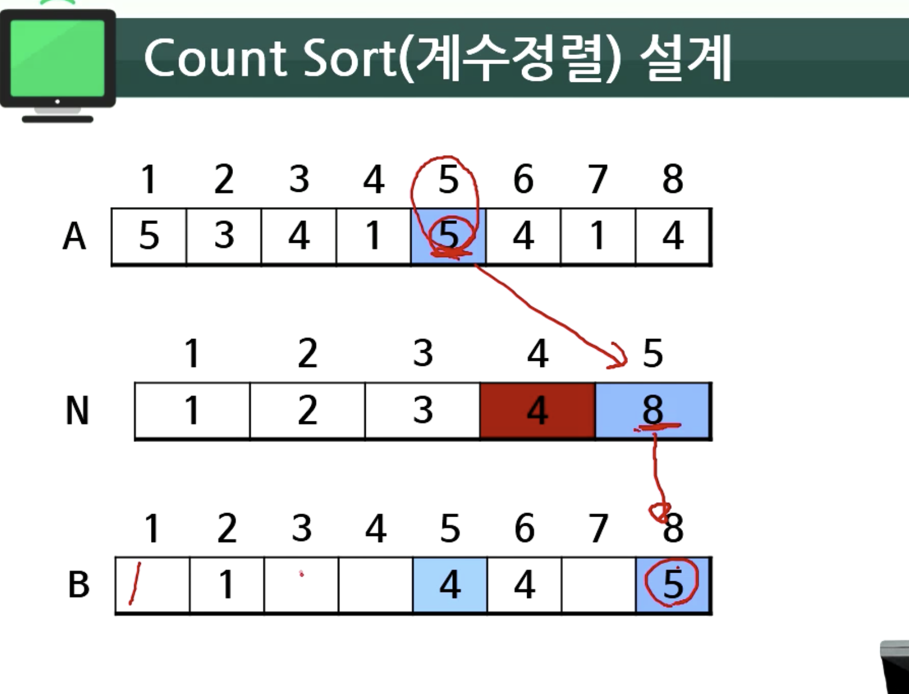
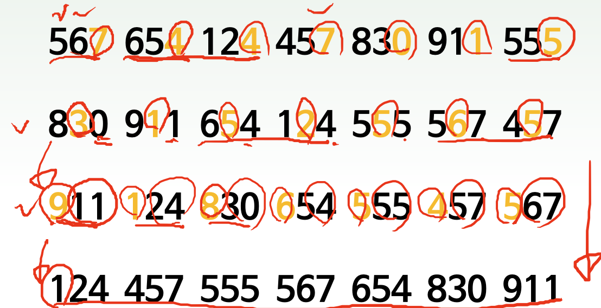

# 05. 계수정렬, 기수정렬

- 분포기반 정렬은 가정을 하나 함
- 가정 : 입력 키 값이 특정한 작은 범위 내에서만 변하는 경우
Ex. 키 값 범위 = [1, k]

- [계수정렬](#계수정렬)
    - [계수정렬 설계](#계수정렬-설계)
    - [계수정렬 코드와 이해](#계수정렬-코드와-이해)
    - [계수정렬 특징 정리](#계수정렬-특징-정리)
- [기수정렬](#기수정렬)
    - [기수정렬 설계](#기수정렬-설계)
    - [기수정렬 특징 정리](#기수정렬의-특징-정리)


## 계수정렬

### 계수정렬 설계


 | 
|:---:|:---:|


- 빈도수를 세서 저장하는 새로운 배열 N을 하나 선언
- 그후 누적 빈도수를 저장하는 N' 배열을 하나 선언
- 원본 배열 A의 오른쪽 끝부터 찾아서 새로운 배열 B에 저장
    1. 해당 원소의 누적 빈도수를 조회 `Ex. 4는 6이다`
    2. 누적 빈도수 값 인덱스로 원소 삽입 `Ex. 4는 6이므로 B의 6에 삽입`
    3. 그후 누적 빈도수 -1을 함 `Ex. 4를 B에 넣었으므로 4의 누적빈도수를 5로 조정`
    
### 계수정렬 코드와 이해

```c
CountSort (int A[ ], int n, int B[ ], int k ) {
/* 입력 : 정렬할 배열 A, 원소의 개수 n, 키의 범위 k
출력 : 정렬된 결과 배열 B */
    for (i = 1; i <= k; i++) /*초기화*/
        N[i] = 0;
    for (j = 1; j <= n; j++) /*각 키의 개수*/
        N[A[j]] = N[A[j]] + 1;
    for (i = 2; i <= k; i++) /*키의 누적 합*/
        N[i] = N[i] + N[i - 1];
        for (i = n; j <= 1; j--) { /*정렬 결과를 배열 B에*/
        B[N[A[j]]] = A[j];
        N[A[j]] = N[A[j]] - 1;
    }
}
```

### 계수정렬 특징 정리

- **평균시간복잡도** = O(n+k)
- **최악시간복잡도** = O(n+k)
- **제자리성** : 제자리 정렬 아님, 입력 크기에 비례하는 B[ ]사용됨
- **안정성** : 안정, 순서대로 뒤쪽 레코드부터 가장 뒤쪽에 배치

단, k는 키 값의 범위
If k=O(n), 시간 복잡도=O(n)

## 기수정렬

### 기수정렬 설계



- 전체 키를 여러 자리로 나누어 각 자리마다 계수 정렬과 같은 안정적 정렬 알고리즘(예:계수정렬, 삽입정렬, 합병정렬 등)을 적용하여 정렬하는 방법
- **낮은 자리부터 순차적으로 정렬**

## 기수정렬의 특징 정리

- 단, d는 키 값의 해당 진법에서의 자리 개수
- **평균시간복잡도** = O(dn)
- **최악시간복잡도** = O(dn)
- **제자리성** : 제자리 정렬 아님, 진법 크기만큼의 메모리 추가
+(경우에 따라)데이터 크기만큼의 메모리 추가
- **안정성** : 안정, 순서대로 뒤쪽 레코드부터 가장 뒤쪽에 배치
